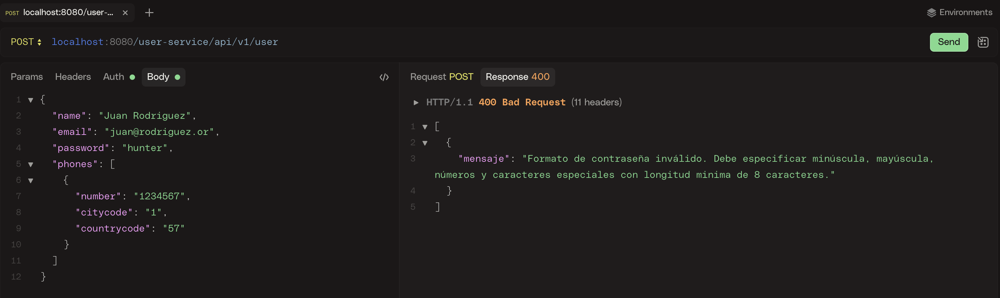

# User API

Para ejecutar este proyecto necesita tener Java 25 y maven 3.9+ instalado en su computadora. despues de compilar, un `user-ms/target/` directorio se generará un archivo con el nombre **MSUser.jar** en el. <br>
Ejecutar el jar con los siguientes comandos:


``` shell
# Clona el código fuente.
 git clone https://github.com/luisrafaelinf/user-ms.git

# Ingresa al directorio.
cd user-ms

# compila el proyecto
mvn ./mvnw --no-transfer-progress clean install


# usa el siguiente comando para ejecutar el proyecto
 java -jar target/MSUser.jar


```

## URL Rest Services:

Por defector la url y puerto del proyecto son: http/localhost:8080/user-service/api

- Crear Usuario:

Crear (POST)
> /v1/user

-El resultado del endpoint antes mencionado se puede ver en las siguientes imagenes.





